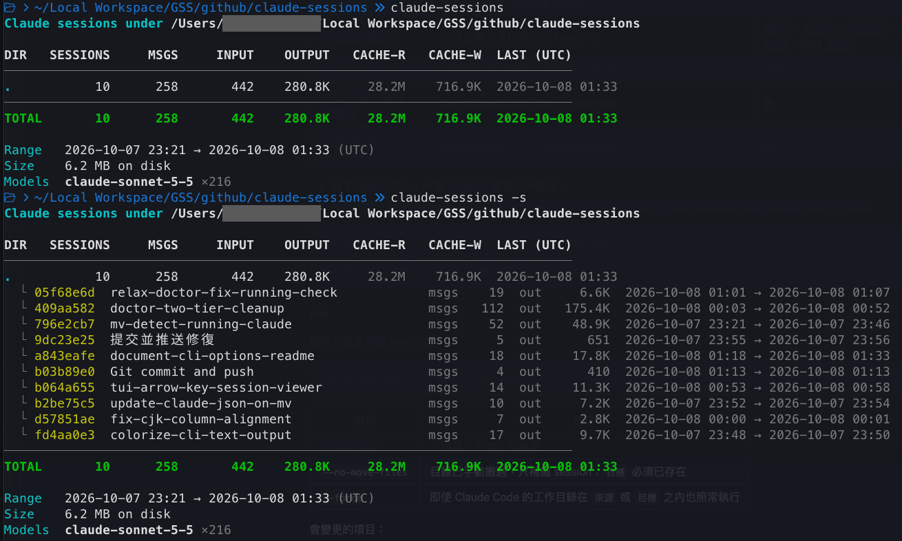

# claude-sessions

[English](README.md) | **繁體中文**

查看 Claude Code 在某個目錄（含子目錄）的 session 統計，並可在搬移目錄時讓 session 一起跟著走。



## 安裝

需要 Rust 工具鏈（`rustc` + `cargo`，用 rustup 安裝，一次即可）：

```sh
curl --proto '=https' --tlsv1.2 -sSf https://sh.rustup.rs | sh
```

`cargo install` 會在本機從原始碼編譯，第一次安裝需要一兩分鐘。

```sh
cargo install --git https://github.com/mrhihi/claude-sessions                # 安裝
cargo install --git https://github.com/mrhihi/claude-sessions --tag v0.1.0   # 指定版本
cargo install --git https://github.com/mrhihi/claude-sessions --force        # 升級
```

- 執行檔會放在 `~/.cargo/bin/claude-sessions`（rustup 已把該目錄加入 PATH）。
- 支援 macOS 與 Linux。

### 預編譯執行檔

不需安裝 Rust：到 [Releases](https://github.com/mrhihi/claude-sessions/releases) 頁面下載對應平台的壓縮檔，解壓縮後把 `claude-sessions` 放到 `PATH` 內的資料夾。壓縮檔解開會得到一個資料夾，內含執行檔、授權文件與 README。下面的 `v0.2.0` 請換成你下載的版本。

**macOS Apple Silicon**（`claude-sessions-<tag>-aarch64-apple-darwin.tar.gz`）

```sh
tar xzf claude-sessions-v0.2.0-aarch64-apple-darwin.tar.gz
mkdir -p ~/.local/bin
cp claude-sessions-v0.2.0-aarch64-apple-darwin/claude-sessions ~/.local/bin/
xattr -d com.apple.quarantine ~/.local/bin/claude-sessions   # 執行檔未簽章，解除 Gatekeeper 封鎖
claude-sessions --version
```

若找不到 `claude-sessions`，在 `~/.zshrc` 加一行 `export PATH="$HOME/.local/bin:$PATH"`，再開新的終端機。

**Windows x64**（`claude-sessions-<tag>-x86_64-pc-windows-msvc.zip`），在 PowerShell 執行：

```powershell
Expand-Archive claude-sessions-v0.2.0-x86_64-pc-windows-msvc.zip .
New-Item -ItemType Directory -Force "$HOME\bin" | Out-Null
Copy-Item claude-sessions-v0.2.0-x86_64-pc-windows-msvc\claude-sessions.exe "$HOME\bin\"
# 只需做一次：把該資料夾加入使用者 PATH，然後開新的終端機
[Environment]::SetEnvironmentVariable("Path", [Environment]::GetEnvironmentVariable("Path", "User") + ";$HOME\bin", "User")
claude-sessions --version
```

執行檔未簽章，第一次執行時 Windows SmartScreen 可能會警告：選「其他資訊」→「仍要執行」。

要驗證下載檔，可與同一個 Release 的 `SHA256SUMS` 比對（macOS：`shasum -a 256 <檔案>`；Windows：`Get-FileHash <檔案>`）。

## 快速開始

```sh
claude-sessions                  # 統計目前目錄（含子目錄）
claude-sessions ~/projects       # 統計指定目錄
claude-sessions -s               # 同時列出每個 session
claude-sessions --all            # 這台電腦上 Claude Code 執行過的所有目錄
claude-sessions --since 7d       # 只看最近 7 天有活動的 session
claude-sessions mv <來源> <目標>   # 搬移目錄並帶著 session
claude-sessions tui              # 互動式瀏覽與管理 session
```

## 指令參考

| 指令 | 用途 |
|---|---|
| `claude-sessions [PATH]` | 統計某目錄（含子目錄）的 session（預設模式）；`--all` 改為統計這台電腦上所有目錄 |
| [`mv`](#mv) | 搬移目錄並帶著 session |
| [`cp`](#cp) | 複製目錄與其 session |
| [`rm`](#rm--clean) | 刪除某目錄的 session |
| [`clean`](#rm--clean) | 刪除目錄已不存在的 session |
| [`doctor`](#doctor) | 找出（並可修復）目錄已不存在所留下的殘留 |
| [`search`](#search) | 搜尋提問與回覆 |
| [`export`](#export) | 把單一 session 輸出成 Markdown 或 JSON |
| [`tui`](#tui) | 互動式介面 |

### 全域選項

所有指令都可使用。

| 選項 | 說明 | 預設 / 可用值 |
|---|---|---|
| `--color <WHEN>` | 輸出上色 | `auto`（預設）、`always`、`never` |
| `--claude-dir <DIR>` | 要讀寫的 Claude 設定目錄 | `~/.claude` |
| `-h`, `--help` | 顯示說明 | |
| `-V`, `--version` | 顯示版本 | |

- `--color auto` 只在 stdout 是終端機、未設定 `NO_COLOR`、且 `TERM` 不是 `dumb` 時上色。
- 錯誤會在 stderr 印出 `error: …`，結束碼為 1。

### 時間格式

`--since` 與 `--older-than` 使用同一套格式。

| 格式 | 範例 | 意義 | 可用於 |
|---|---|---|---|
| `Nh` | `12h` | N 小時前 | `--since`、`--older-than` |
| `Nd` | `7d` | N 天前 | `--since`、`--older-than` |
| `Nw` | `2w` | N 週前 | `--since`、`--older-than` |
| `YYYY-MM-DD` | `2026-01-31` | 該日 00:00 UTC | 僅 `--since` |

其他格式一律報錯。

### 統計（預設模式）

```sh
claude-sessions [PATH] [選項]
```

| 選項 | 說明 | 預設 / 可用值 |
|---|---|---|
| `PATH` | 要統計的目錄（含子目錄），不必實際存在 | `.` |
| `-s`, `--sessions` | 同時列出每個 session | 關 |
| `--json` | 以 JSON 輸出整份報告 | 關 |
| `--since <AGE\|DATE>` | 只保留最後活動時間不早於截止點的 session；總計會重算，沒有 session 的目錄會被略過 | 全部 |
| `--sort <KEY>` | 排序目錄（及目錄內的 session） | `path`、`size`、`tokens`、`messages`、`last-used`；預設 `path` |
| `--limit <N>` | 只顯示前 N 個目錄（不截斷 session） | 全部 |
| `-x`, `--exclude <NAME>` | 額外排除此名稱的目錄，可重複使用 | 無 |
| `--no-default-excludes` | 取消預設排除（`-x` 指定的仍然有效） | 關 |

- 除了 `path` 之外，所有 `--sort` 都是由大到小。
- 預設排除：`.git node_modules target .venv venv __pycache__ .idea .vscode dist build .next .cache`

```sh
claude-sessions --sort tokens --limit 5 --since 30d
claude-sessions -x vendor -x third_party
claude-sessions --json -s > report.json
```

### mv

搬移目錄並帶著 session。

```sh
claude-sessions mv <來源> <目標> [選項]
```

| 選項 | 說明 |
|---|---|
| `--dry-run` | 只預覽，不做任何變更 |
| `--no-move-files` | 目錄已手動搬過，只補搬 session；`目標` 必須已存在 |
| `--force` | 即使 Claude Code 的工作目錄在 `來源` 或 `目標` 之內也照常執行 |

會變更的項目：

- 搬移實體目錄。
- 改名 `~/.claude/projects/` 下對應的資料夾。
- 改寫 session jsonl 內的目錄欄位：`cwd`、`relocatedCwd`、`projectPath`、`live_cwd`、`workingDirectory`、`realParentDir`（工具輸入輸出與訊息內文屬於歷史，不會動）。
- 改寫 `history.jsonl` 與 `~/.claude.json`（兩者會先備份，見[備份](#備份)）。

以下情況會拒絕：

| 情況 | 處理方式 |
|---|---|
| `來源` 不是目錄 | 檢查路徑（若已不存在，改用 `--no-move-files`） |
| `目標` 已存在 | 換一個路徑（`--no-move-files` 則要求它必須存在） |
| `目標` 在 `來源` 之內，或兩者相同 | 換一個路徑 |
| 有 Claude Code 程序在 `來源` 或 `目標` 之內（會列出） | 先結束那些 session，或加 `--force` |

- 與 `/bin/mv` 一致：`目標` 若是既有目錄，`來源` 會被搬進去（`mv proj ..` → `../proj`）；否則 `目標` 就是最終路徑，也就是改名，名稱改變時會印出提示。`目標` 含 `\` 會被拒絕（未加引號的 `\` 會被 shell 吃掉，`GSSCLI\GSSDRIVE` 會變成 `GSSCLIGSSDRIVE`）。
- 更新後會用 Claude `/resume` 查找 session 的方式複驗（資料夾名稱由新路徑算出、紀錄的目錄），不一致就報錯。若目錄搬完後有步驟失敗，錯誤訊息會印出可完成後續的 `--no-move-files` 指令。
- 在工具之外改名而被遺留的 session 會在 `doctor` 中顯示為孤兒；若同層只有一個相近名稱的目錄，會一併列出可能的新位置。
- `--dry-run` 也會提醒：若有 Claude Code 在執行，真正執行時會被擋下。
- 結束時會印出 `undo:` 一行。要還原搬移，反向再跑一次 `mv`（`claude-sessions mv <目標> <來源>`），資料夾、`cwd` 紀錄與 history 都會精確還原。

### cp

複製目錄與其 session，原本的不動。

```sh
claude-sessions cp <來源> <目標> [選項]
```

| 選項 | 說明 |
|---|---|
| `--dry-run` | 只預覽 |
| `--no-copy-files` | 目錄已手動複製，只複製 session |

- 路徑錯誤的規則與 `mv` 相同，另外不可複製到自己身上。
- 目錄以系統的 `cp -a` 複製。
- 只有複本的 `cwd` 會改成新路徑，原本的仍指向 `來源`。
- 不會動 `history.jsonl` 與 `.claude.json`，所以 Claude 會重新詢問是否信任新目錄。
- 沒有 `--force`，也不檢查 Claude 是否正在執行。

### rm / clean

永久刪除 session。兩者只差在目標範圍。

```sh
claude-sessions rm <PATH> [選項]   # PATH 及其子目錄對應的專案
claude-sessions clean [選項]       # 目錄已不存在的專案
```

| 選項 | 說明 |
|---|---|
| `--older-than <AGE>` | 只刪最後活動早於截止點的 session（`12h`、`30d`、`2w`）。不加則整個專案資料夾都刪。 |
| `--dry-run` | 印出計畫後停止 |
| `-y`, `--yes` | 略過 `[y/N]` 確認 |
| `-i`, `--interactive` | 逐個資料夾詢問：`y` / `n` / `a`（全部）/ `q`（離開）。不可與 `-y` 併用。 |
| `--purge-config` | 一併清理 `history.jsonl` 與 `.claude.json`（見下方） |
| `--force` | 略過 Claude 執行中的檢查 |

安全規則：

- 沒加 `-y` 時會先詢問確認。
- 程式無法改變父 shell 的目錄，所以 `x` 是把路徑交回來。把下面函式加進 `~/.zshrc` / `~/.bashrc` 就能真的 `cd`：

  ```sh
  cs() { local f; f=$(mktemp) || return; claude-sessions tui --cd-file "$f"; [ -s "$f" ] && cd "$(cat "$f")"; rm -f "$f"; }
  ```

- 用 `h` 開出的 shell 會帶有 `CLAUDE_SESSIONS_TUI=1`，可用來在提示字元標示目前在 TUI 之下。
- 若 Claude Code 正在受影響的目錄執行會拒絕（`--force` 可強制）。
- 資料夾含自動記憶時，計畫會顯示 `(+N memory file(s))`。

除了 transcript，還會刪除：

| 會刪除 | 不會動 |
|---|---|
| `file-history/<id>`、`session-env/<id>`、`tasks/<id>`、`debug/<id>`（存在時） | `plans/`、`shell-snapshots/`（它們無法對應到某個 session） |

`--purge-config`：

- 預設不動 `history.jsonl` 與 `.claude.json`，因為那是你的提示詞歷史。
- 加上此旗標會移除對應的 `history.jsonl` 行。
- `.claude.json` 的專案項目只在整個資料夾被刪時才移除（搭配 `--older-than` 的部分刪除不會動）。
- 兩個檔案都會先備份（見[備份](#備份)）。
- 需要先關閉 Claude Code（`--force` 可強制）。

```sh
claude-sessions rm ~/old-project --dry-run
claude-sessions rm ~/projects --older-than 30d -i
claude-sessions clean -y --purge-config
```

### doctor

找出已不存在的目錄與 session 留下的殘留。

```sh
claude-sessions doctor [--json]
claude-sessions doctor --fix [--delete] [--dry-run] [-y] [--force]
```

| 選項 | 說明 | 需搭配 `--fix` |
|---|---|---|
| `--json` | 機器可讀的診斷結果（與 `--fix` 併用時會被忽略） | 否 |
| `--fix` | 移除失效的 `history.jsonl` 行與 `.claude.json` 項目（會先備份） | |
| `--delete` | 另外**永久刪除**硬碟上的殘留檔案 | 是 |
| `--dry-run` | 印出計畫後停止 | 是 |
| `-y`, `--yes` | 略過 `[y/N]` 確認 | 是 |
| `--force` | Claude Code 執行中仍照常執行（只在需要編輯紀錄時才檢查） | 是 |

`doctor` 會回報：

- 目錄已不存在的 session 資料夾（提示：`mv <舊> <新> --no-move-files` 或 `doctor --fix --delete`）。
- 失效的 `history.jsonl` 項目與失效的 `.claude.json` 項目。
- 沒有 transcript 的 per-session 資料（`file-history`、`session-env`、`tasks`、`debug`）。
- `projects/` 底下完全沒有 transcript 的資料夾（無從得知原本的工作目錄）。
- 只剩記憶檔的資料夾（僅作提示）。

兩個層級：

| 指令 | 移除內容 | 還原 |
|---|---|---|
| `doctor --fix` | 只移除失效紀錄，硬碟上的檔案不動，結束時會列出仍留著的項目 | 備份可完整還原 |
| `doctor --fix --delete` | 另外**永久刪除**目錄已不存在的 session 資料夾、沒有 transcript 的 per-session 資料、空的專案資料夾 | 無法從備份還原 |

- `clean` 是針對 session 資料夾的較窄工具（有 `--older-than`、`-i`、`--purge-config`）。
- 永遠不會刪：
  - 含有自動記憶的專案資料夾（`memory/` 內有檔案，請用 `claude purge <path>`）。
  - `plans/` 與 `shell-snapshots/`。
  - 名稱不像 session id 的項目。
  - 最近 24 小時內動過的東西。
  - `sessions/*.json` 內記錄的 session 資料。

### search

搜尋提問與回覆的文字。

```sh
claude-sessions search <KEYWORD> [選項]
```

| 選項 | 說明 | 預設 |
|---|---|---|
| `<KEYWORD>` | 字面子字串（不是正規表示式），不可為空 | |
| `-i`, `--ignore-case` | 不分大小寫 | 區分大小寫 |
| `--path <DIR>` | 只搜尋此目錄及其子目錄的 session | 所有專案 |
| `--limit <N>` | 比對到 N 則訊息後停止 | `20` |

- 搜尋範圍與 `export` 相同，包含 `[tool: …]` 行。
- 每個 session 會印出 8 碼 id、標題與目錄。
- 每個命中會印出角色、`YYYY-MM-DD HH:MM` 與片段（該訊息第一個符合的行，符合處會標示）。
- 結尾會顯示 `N match(es) in M session(s)`；若提早停止會提示調高 `--limit`；沒有結果則顯示 `(no matches)`。

### export

輸出單一 session。

```sh
claude-sessions export <ID> [選項]
```

| 選項 | 說明 | 預設 / 可用值 |
|---|---|---|
| `<ID>` | 完整 session id 或唯一的前綴。前綴不唯一時會列出最多 5 個候選。 | |
| `--format <FMT>` | 輸出格式 | `md`（預設）、`json` |
| `-o`, `--output <FILE>` | 寫入檔案 | stdout |

包含與略過的內容：

| 包含 | 略過 |
|---|---|
| 使用者與助理的文字；`[tool: Name] <第一個參數>` 行；`[image]` 標記 | thinking 區塊、工具結果、subagent（sidechain）訊息、meta 訊息 |

- 共用同一個 message id 的連續助理行會合併成一個回合。
- Markdown 以標題開頭，接著是 Session、Directory、Time (UTC)、Models 幾行；每個回合是 `## User|Assistant · 時間戳`。
- JSON 格式為 `{session, directory, turns[]}`，每個回合有 `role`、`timestamp`、`model`、`text`。

### tui

```sh
claude-sessions tui
```

- 需要終端機（stdin 與 stdout）。
- 列出所有專案（孤兒以紅色標示），按 `Enter` 開啟該目錄的選單：查看 sessions、在該目錄開 shell、或離開並 `cd` 過去。`→` 直接進入 sessions；session 可開啟閱讀。
- `--cd-file FILE`：「離開並 cd」把選到的目錄寫到這個檔案（預設在離開 TUI 後印到 stdout）。
- 支援 `--claude-dir` 與 `--color`。
- 以 `--no-default-features` 建置可不含 TUI（及其 `ratatui` 依賴）。

| 按鍵 | 動作 |
|---|---|
| `↑` `↓` / `j` `k` | 移動 |
| `PgUp` `PgDn` | 移動 10 列（閱讀時為一頁） |
| `g` `G` / `Home` `End` | 第一列 / 最後一列 |
| `Space` | 勾選並往下移（閱讀時為下一頁） |
| `a` | 全選 / 全不選 |
| `Enter` | 專案：選單（`s` 看 sessions、`h` 在該目錄開 shell — `exit` 回到列表、`x` 離開並 cd）；session 列表：閱讀 |
| `→` | 開啟專案的 sessions，或閱讀 session |
| `Esc` / `←` | 返回（最上層的 `Esc` 先清除過濾，再按則離開；`←` 不會離開） |
| `/` | 過濾（`Enter` 確認，`Esc` 清除） |
| `o` | 只看孤兒 |
| `s` | 切換排序：path、size、last used |
| `d` | 刪除已勾選的列（沒勾選就是游標所在列）；`y` 確認，`n` / `Esc` 取消，`p` 切換 `--purge-config` |
| `m` / `c` | 搬移 / 複製專案目錄（詢問目標路徑，執行 `mv` / `cp` 後等待 `Enter`） |
| `e` | 把 session 匯出成 Markdown（預設檔名 `<id>.md`；於 Sessions 檢視） |
| `r` | 重新載入 |
| `?` | 顯示所有按鍵 |
| `q` / `Ctrl-C` | 離開 |

- 若 Claude Code 正在受影響的目錄執行，刪除會被拒絕；開啟 `--purge-config` 時，只要有任何 Claude Code 在執行就會拒絕。

## 與 `claude purge` 的分工

`claude purge` 會整個移除一個專案，本工具處理它沒涵蓋的情境。

| | `claude purge [path]` | `claude-sessions` |
|---|---|---|
| 範圍 | 一個專案的所有資料（transcripts、file history、`history.jsonl` 中該專案的行與 `.claude.json` 項目）；`--all` 清掉每個專案 | 只處理你選定的部分 |
| 孤兒 | 找不到 | `doctor` 可找出 |
| 只刪舊 session | 不行 | `--older-than` |
| 提示詞歷史 | 會移除 | 預設保留，加 `--purge-config` 才移除 |
| Claude Code 執行中 | | 拒絕動作 |

要把某個專案完全移除，用 `claude purge <path>` 就對了。

## 備份

`mv`、`rm`/`clean --purge-config`、`doctor --fix` 在改寫 `history.jsonl` 或 `~/.claude.json` 之前，會先把檔案複製到同一個資料夾。

- **檔名**：`<原檔名>.claude-sessions-<UTC 時間>.bak`，例如 `history.jsonl.claude-sessions-20261008T083342Z.bak`。
- **不會覆蓋**：檔名專屬於本工具。
- **保留數量**：每個檔案只保留最新 3 份。
- **一般的 `*.bak`**（其他工具或本工具舊版留下的）不會被動到，也不會被計入。

備份能還原什麼：

| 指令 | 把備份複製回原檔會… |
|---|---|
| `doctor --fix` | …完整還原：只移除了失效紀錄，沒有刪任何 session。 |
| `rm` / `clean --purge-config` | …只能找回「被移除了什麼」的**紀錄**。session 本身已永久刪除，還原的 history 行會指向已不存在的對話。 |
| `mv` | …光靠備份不夠：session 檔裡被改寫的 `cwd` 與改名的資料夾沒有備份。請改用 `claude-sessions mv <新> <舊>` 還原。 |

## 發行（維護者）

```sh
cargo xtask version              # 目前版本、最新 tag、建議的下個版本
cargo xtask release 0.2.0 -n     # 乾跑：執行所有檢查，不做任何變更
cargo xtask release 0.2.0        # 更新 Cargo.toml、commit、建立 v0.2.0 tag 並推送
```

推送 tag 會觸發 `.github/workflows/release.yml`，建置 macOS Apple Silicon 與 Windows 執行檔並附加到 GitHub Release。加上 `-y` 可略過確認提示。
